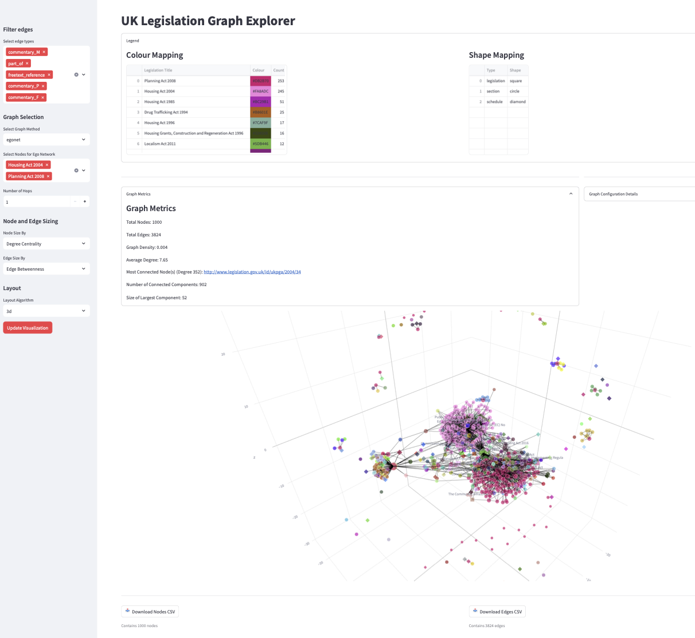

# Streamlit App

The Streamlit app provides an interactive interface for exploring the UK legislation graph

## Example Image

Below is an example image of the Streamlit application:



## Running the App

Run the Streamlit app locally

```bash
poetry run streamlit run demo/app.py
```

NOTE: Before attempting to run the application, you will need to process the raw XML files, and build the graph using the following, or according to your own preference. See [Processing raw data](https://github.com/i-dot-ai/lex-graph-build/tree/main?tab=readme-ov-file#processing-raw-data) and [Building the graph](https://github.com/i-dot-ai/lex-graph-build/tree/main?tab=readme-ov-file#building-the-graph).

```bash
poetry run python scripts/preprocess.py --all
poetry run python scripts/build_graph.py --all
```

## Functionality

The [app.py](demo/app.py) file in the [demo](demo) directory is the main entry point for the Streamlit application. It provides various functionalities for exploring and visualising the legislation graph. Please note that the streamlit app currently only visualises the top 1000 nodes based on their degree centrality, due to the speed of the vizualisation libraries.

1. Graph Selection Options:
    - The sidebar provides options for selecting different graph methods, such as egonet, nth_largest_community, giant_component and nth_largest_component.
2. Node and Edge Sizing:
    - The sidebar allows users to select how nodes and edges should be sized, with options like Degree Centrality, Betweenness Centrality and Constant.
3. Visualisation Options:
    - The sidebar provides options for selecting different layout algorithms for visualising the graph, including 3d, spring, kamada_kawai (regular and 3d), fruchterman_reingold etc.
4. Filtering Edges:
    - The sidebar allows users to filter edges based on their types. For information on the types, see: [CLML Reference: Commentaries](https://legislation.github.io/clml-schema/userguide.html#commentaries)
5. Graph Rendering:
    - The selected graph is rendered using Plotly, with nodes and edges coloured and sized based on the selected options.

Please note that the Streamlit visualisation interface may experience performance limitations when displaying very large subgraphs or handling complex queries on the full dataset. It has not been optimised for efficiency.
